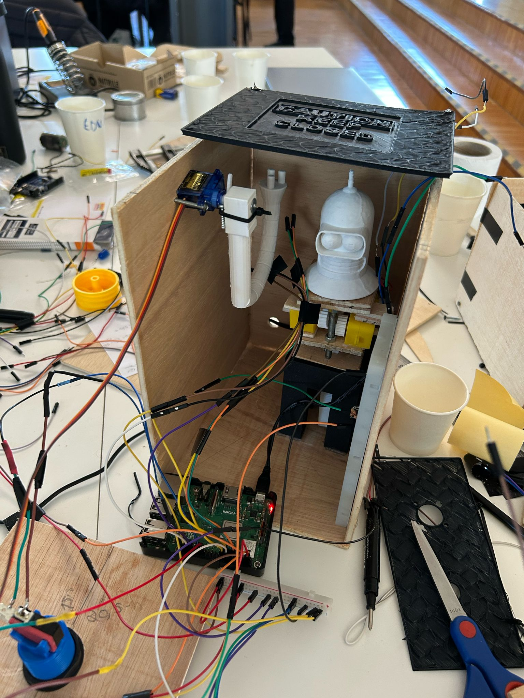

# makeathon-neec-2025



A quirky "Useless Box" that brings Bender (from Futurama) to life! Features a self-flipping switch, amusing TTS responses, and a pop-up Bender head for added fun. Built entirely in Python using event-driven programming and threading.

🏆 Awarded **2nd Place** at Makeathon NEEC! 🏆

[NEEC Instagram post](https://www.instagram.com/p/DGg1k1StcIy/?img_index=4)

## Features
- A switch that flips itself back automatically when toggled.
- Two buttons, each triggering unique TTS responses.
- A proximity sensor that detects nearby movement and reacts accordingly.
- Bender's head pops up when the switch is flipped.
- Custom funny TTS messages for different interactions.

## Tech Stack
- **Language**: python
- **Concepts**: event-based programming, threading
- **Hardware**: raspberry Pi, switch, buttons, proximity sensor, servo motor

## Demo


## Installation & Usage
This project is designed to run on a Raspberry Pi.
1. Clone the repository:
   ```sh
   git clone https://github.com/FawkesOficial/makeathon-neec-2025
   cd makeathon-neec-2025/bender
   ```
2. Set up a virtual environment and install dependencies:
   ```sh
   python -m venv venv
   source venv/bin/activate  # On Windows use `venv\Scripts\activate`
   pip install -r requirements.txt
   ```
3. Run the project:
   ```sh
   python main.py
   ```

## License
This project is licensed under the GPLv3 License - see the [LICENSE](LICENSE) file for details.
